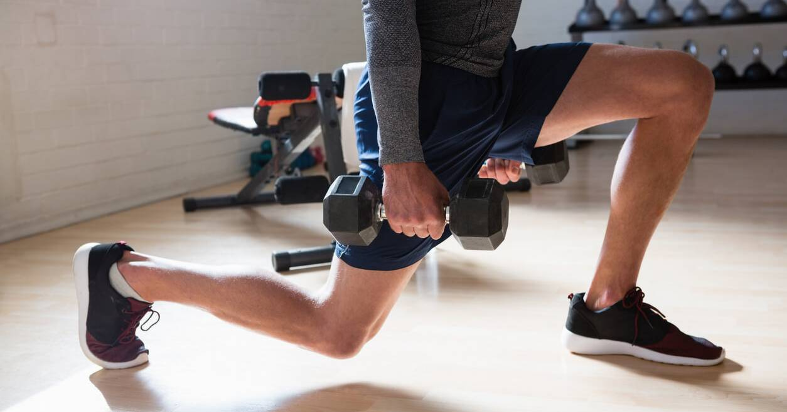
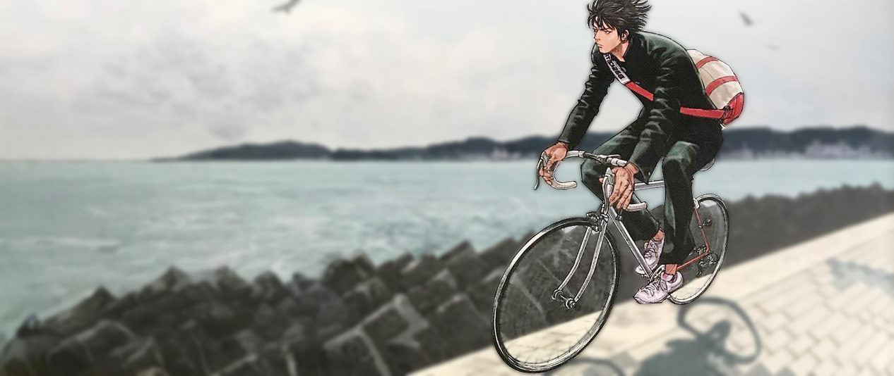

<!--$layout: block-->
<!--$lang: zh_CN--> 
<!--$en_US: /English/--> 
<!--$ja_JP: /日本語/--> 

<!--#Hero--> 
<!--$background-image-:https://seedunk.com/media/sd-file/ED1.rw-1920.jpg--> 
<!--$background-color:#ffffff-->  
<!--$color:#333333--> 

## 关于我
# SEE!DUNK
  
  突然有那么一瞬间，我闻到了夏天的味道

   [查看更多](/简体中文/SLAMDUNK/神奈川.md?theme=brand&class=right%20bottom) 
<!--Hero #--> 

<!--#Features-->
  <!--$class:mt alt-->  
  *  
    ## 铁膝
    通过力量和拉升练就钢铁膝盖
     
    [查看更多](./简体中文/探索/铁膝/README.html?theme=brand&class=mt)
 *    
    ## 县镰仓市坂ノ下35-34
    这个地方出现在新装再编版灌篮高手第二集的封面上
     
    [查看更多](./简体中文/世界那么大/神奈川.md?theme=brand&class=mt) 
 
<!--Features #-->

  [poster](./简体中文/远古/20141207-乔布斯在斯坦福大学的演讲/video/video.m3u8?class=video&m3u8=self)